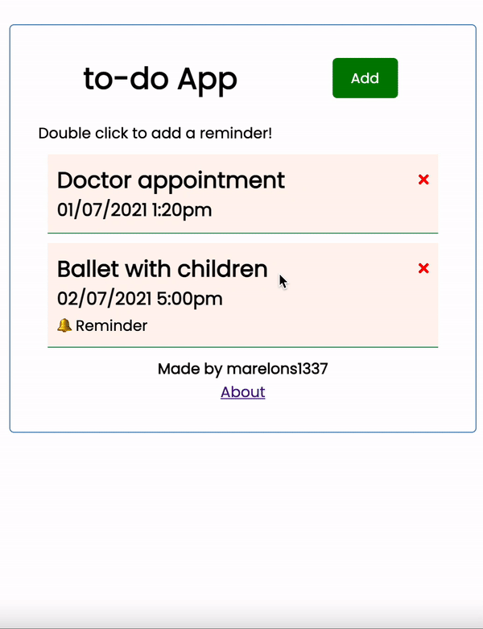

# ToDo
Simple ToDo app created with Angular just to try it out.

## Development server

`npm install`

`ng serve` 

`npm run server`
Runs  
`json-server --watch db.json`
db.json contains all the mock records for the app.

